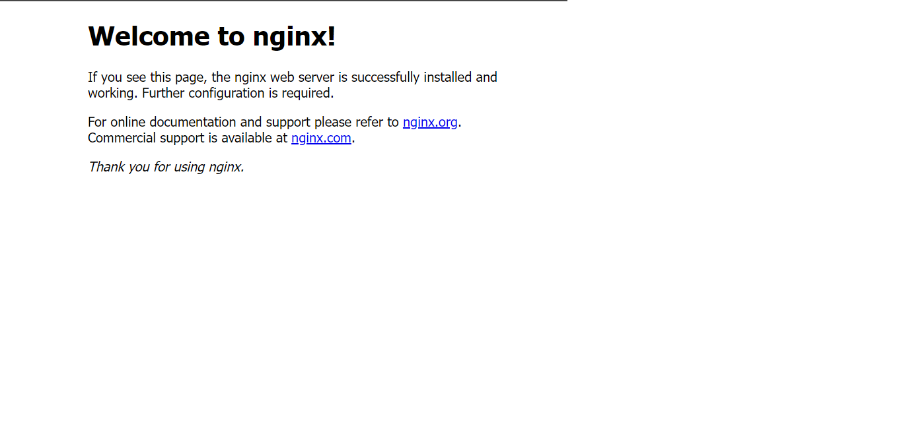
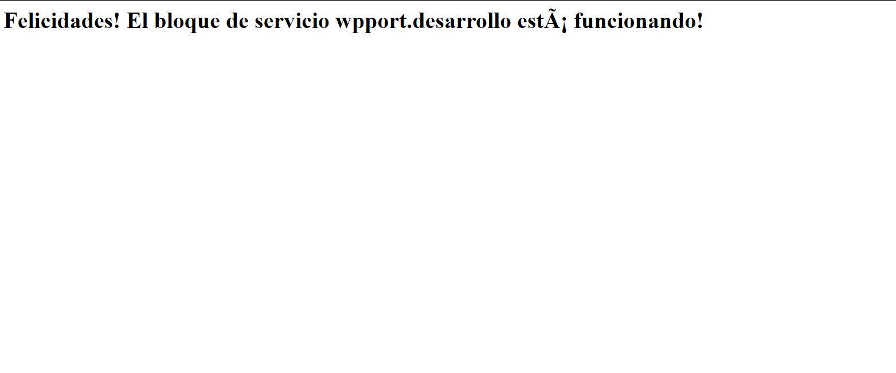

# Instalar NGINX y configurar las reglas del firewall

## 1. Instalar NGINX

``` shell
sudo apt install nginx
```

## 2. Ajustar el Firewall

!!! note "Información"
    Procedimiento de instalación basado en estos enlaces

    - Nginx:
        - [How To Install Nginx on Ubuntu 22.04](https://www.digitalocean.com/community/tutorials/how-to-install-nginx-on-ubuntu-22-04)
        - [How To Create a Self-Signed SSL Certificate for Nginx in Ubuntu 20.04](https://www.digitalocean.com/community/tutorials/how-to-create-a-self-signed-ssl-certificate-for-nginx-in-ubuntu-20-04-1)
        - [Minimal Nginx front end configuration for Plone on Ubuntu/Debian Linux using virtual hosts](https://opensourcehacker.com/2011/12/28/minimal-nginx-front-end-configuration-for-plone-on-ubuntudebian-linux/)
    - SSH: [How to Install and Enable OpenSSH on Ubuntu 22.04](https://linuxhint.com/install-enable-openssh-ubuntu-22-04/)
    - Firewall: [How To Set Up a Firewall with UFW on Ubuntu 22.04](https://www.digitalocean.com/community/tutorials/how-to-set-up-a-firewall-with-ufw-on-ubuntu-22-04)

Antes de probar NGINX, el firewall necesita ser configurado para permitir el acceso al servicio. 
Nginx se registra así mismo como un servicio con ``ufw`` durante la instalación, permitiendo de manera directa dar permisos de acceso a NGINX.

Vamos a listar las configuraciones de las aplicaciones para las que ``ufw`` sabe como funcionar, tecleamos:

``` shell
sudo ufw app list
```

Deberiamos ver una lista de perfiles de aplicación:
``` output
Available applications:
    Nginx Full
    Nginx HTTP
    Nginx HTTPS
    OpenSSH
```
Activaremos ahora el perfil de acceso por el puerto ``80`` y el ``443``:

``` shell
sudo ufw enable
sudo ufw allow 'Nginx Full'
```

La salida a este comando:
``` output
Firewall is active and enabled on system startup
Rules updated
Rules updated (v6)
```

Verificamos el estado en el Firewall:
``` shell
sudo ufw status
```

La salida:

```
Status: active

To                         Action      From
--                         ------      ----
Nginx Full                 ALLOW       Anywhere
Nginx Full (v6)            ALLOW       Anywhere (v6)
```

Permitimos también las conexiones SSH entrantes:
``` shell
sudo ufw allow ssh
```

## 3. Comprobar el servidor WEB

``` shell
service nginx status
```

Si la salida es cómo esta

``` output
* nginx is not running
```

Ejecutaremos

``` shell
sudo service nginx start
```

Salida:
``` output
* nginx is running
```

Vamos a verificar a través de un navegador:

``` http
http://localhost
```

Deberías ver una pantalla de bienvenida a NGINX
<figure markdown>
  { width="100%" }
  <figcaption>http://localhost</figcaption>
</figure>

## 4. Comandos del servicio NGINX

!!! info "Comandos útiles de NGINX"
    - Para detener el servicio:
        ``` shell
        sudo systemctl stop nginx
        ```
    - Para arrancar el servicio:
        ``` shell
        sudo systemctl start nginx
        ```
    - Para reiniciar el servicio:
        ``` shell
        sudo systemctl restart nginx
        ```

## 5. Configurar Server Blocks

Cuando se utiliza el servidor web NGINX, los *service blocks* (similares a los virtual hosts de Apache), pueden ser usados para encapsular detalles de configuración y host para más de un dominio en un solo servidor.

Ahora configuraremos un dominio denominado ``weppor.desarrollo`` para poder acceder posteriormente al **sitio Plone 6 de PortalONCE**

``` shell
sudo mkdir -p /var/www/weppor.desarrollo/html
sudo chown -R $USER:$USER /var/www/weppor.desarrollo/html
sudo chmod -R 755 /var/www/weppor.desarrollo
```

Crearemos ahora una página HTML de ejemplo:

``` shell
nano /var/www/weppor.desarrollo/html/index.html
```

``` html title="index.html"
<html>
    <head>
        <title>Bienvenido a tu weppor.desarrollo!</title>
    </head>
    <body>
        <h1>Felicidades!  El bloque de servicio weppor.desarrollo está funcionando!</h1>
    </body>
</html>
```

Para que NGINX pueda servir este contenido, será necesario crear un server block con las directivas adecuadas. En vez de modificar la configuración por defecto directamente, crearemos una nueva en ``/etc/nginx/sites-available/weppor.desarrollo``:

``` shell 
sudo nano /etc/nginx/sites-available/weppor.desarrollo
```

``` nginx title="/etc/nginx/sites-available/weppor.desarrollo"
server {
        listen 80;
        listen [::]:80;

        root /var/www/weppor.desarrollo/html;
        index index.html index.htm index.nginx-debian.html;

        server_name weppor.desarrollo www.weppor.desarrollo;

        location / {
                try_files $uri $uri/ =404;
        }
}
```
Activamos la configuración creando un vínculo simbólico a ``sites-enabled``, que es de donde NGINX obtiene los sitios en su arranque_
```
sudo ln -s /etc/nginx/sites-available/weppor.desarrollo /etc/nginx/sites-enabled/
```

Verificamos que todo esté correcto en la configuración:

```shell
sudo nginx -t
```
``` output
nginx: the configuration file /etc/nginx/nginx.conf syntax is ok
nginx: configuration file /etc/nginx/nginx.conf test is successful
```

Y reiniciamos el servicio
```
sudo service nginx restart
```
Primeramente, hay que añadir nuestro dominio ``weppor.desarrollo`` al archivo ``hosts``
Asegúrate de no tenerlo definido para otro dominio. Si es así, puedes añadir este dominio separandolo por comas:

``` yaml title="hosts"
127.0.0.1 weppor.desarrollo, otro@dominio.com
```
Por último, con el navegador accede a [http://weppor.desarrollo](http://weppor.desarrollo), deberías ver la página de prueba que creamos anteriormente.
<figure markdown>
  { width="100%" }
  <figcaption>http://weppor.desarrollo</figcaption>
</figure>


!!! tip "Volveremos a la configuración Nginx"

    En capítulos siguientes volveremos a esta configuración para redirigir el dominio al sitio Plone