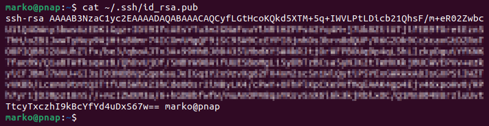

# Acceso SSH a los repositorios desde el servidor Ubuntu

Para disponer de acceso SSH a los repositorios, por ejemplo a :simple-bitbucket: **Bitbucket** o a :simple-github: **Github**, lo más sencillo es crear un par de claves ssh pública/privada que simplifique el proceso de autenticación/autorización en los repositorios.

## Creación del directorio ``.ssh``

1. Si no disponemos del directorio ``~/.ssh``, lo creamos. La opción **``-p``** nos asegura que el sistema no devolverá un error si el directorio ya existe:

``` shell
mkdir -p ~/.ssh
```

2. Cambiaremos los permisos del directorio, para que el usuario tenga permisos de **lectura**, **escritura** y **ejecución**:

``` shell
chmod 0700 ~/.ssh
```

3. Ejecutaremos el comando ``ssh-keygen`` para crear el par de claves RSA:

``` shell
ssh-keygen
```

4. Durante el proceso se nos preguntará por el path. Pulsa ++enter++ para almacenar la clave en el directorio ``.ssh``
5. El sistema también nos preguntará si se debe añadir una frase de clave como capa de seguridad adicional, puedes dejarla en blanco.

## Añadir la clave pública RSA en tu repositorio

El archivo ``~/.ssh/id_rsa.pub`` contiene la contiene la clave pública que ya puedes subir al repositorio de tu elección.

<figure markdown>
  { width="100%" }
  <figcaption>id_rsa.pub</figcaption>
</figure>

Sólo tienes que copiar el contenido y crear una clave ssh desde tu cuenta de Github, BitBucket o Gitlab.


