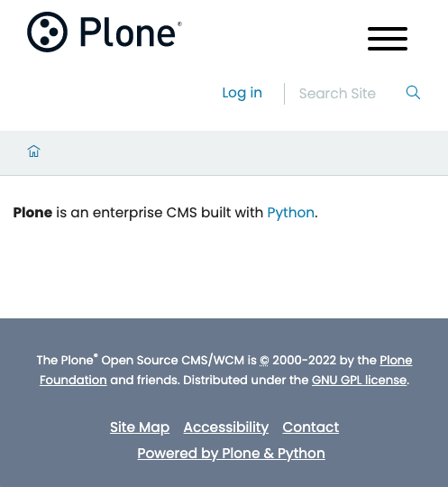

---
myst:
  html_meta:
    "description": "How to install Plone 6 from its packages."
    "property=og:description": "How to install Plone 6 from its packages."
    "property=og:title": "Install Plone from its packages"
    "keywords": "Plone, Plone 6, install, pip, packages, source, cookiecutter"
---


# Instalar usando los paquetes

Cuando desea un control total sobre el desarrollo o los despliegues, instalar Plone usando los paquetes es una buena opción.


## Requisitos del sistema

Los requisitos de hardware a continuación brindan una estimación aproximada de la configuración de hardware mínima necesaria para un servidor Plone.

Los complementos y soluciones de caché podrían aumentar los requisitos de memoría RAM.

Una única instalación Plone es capaz de correr múltiples sitios Plone.
Podrías alojar varios sitios Plone en el mismo servidor.

-   Casi cualquier sistema operativo moderno, incluyendo Linux, macOS y Windows, pero se recomienda un sistema operativo de tipo Unix/Linux.
-   Se requiere un mínimo de 256MB de RAM y 512 MB de espacio de intercambio por cada sitio Plone.
    Se recomiendan 2 GB o más de RAM por cada sitio Plone.
-   Se requieren, al menos, un mínimo de 512 MB de espacio libre en disco.
    Se recominedan, al menos, 40 GB o más de espacio libre en disco.


### Pre-requisitos para la instalación

-   [Python](https://www.python.org/downloads/) 3.8, 3.9, or 3.10.
-   `Cookiecutter`
-   `nvm`
-   `Node.js` LTS 16.x (consultar la nota "Actualización")
-   `Yeoman`
-   `Yarn`
-   `GNU make`

!!! note "Actualización"
    [Node.js 18 está en modo LTS desde el 2022-10-25](https://github.com/nodejs/release#release-schedule), y Node.js 16 ahora está en modo "mantenimiento".
        Sin embargo, debido a cambios en las bibliotecas SSL internas, algunas dependencias de Volto han quedado obsoletas y deben actualizarse para continuar trabajando en Node.js 18, principalmente [Webpack 4](https://github.com/webpack/webpack/issues/14532#issuecomment-947525539).
        Todavía puede usarlo, pero Node.js debe ejecutarse con un indicador especial: `NODE_OPTIONS=--openssl-legacy-provider`.

    !!! tip "Ver también..."
        Pull request de Volto, [Support Node 18](https://github.com/plone/volto/pull/3699).


#### Python

Instalar python está más allá del ámbito de esta documentación.
Sin embargo, se recomienda usar un gestor de versiones de Python, [`pyenv`](https://github.com/pyenv/pyenv), que le permite instalar múltiples versiones en su entorno de desarrollo sin alterar o destruir el Python de su sistema.


#### Cookiecutter

Instale o actualice `Cookiecutter` en el Python de su usuario:

```shell
pip install --user --upgrade cookiecutter
```

#### nvm

Los siguientes comandos de terminal de sesión usan `bash`, adaptelos para ajustarse a su shell.

!!! success "Ver también..."
    Consulte la [ instalación de `nvm` y la documentación de actualización del script](https://github.com/nvm-sh/nvm#install--update-script).

    Para el shell `fish`, consulte [`nvm.fish`](https://github.com/jorgebucaran/nvm.fish).


1.  Crea tu perfil de shell, si no existe.

    ```shell
    touch ~/.bash_profile
    ```

2.  Descargue y ejecute el script de instalación y actualización `nvm` y conéctelo a `bash`.

    ```shell
    curl -o- https://raw.githubusercontent.com/creationix/nvm/v{NVM_VERSION}/install.sh | bash
    ```

3. Fuente de su perfil.
   También puede cerrar la sesión y abrir una nueva.
    ```shell
    source ~/.bash_profile
    ```

4.  Verifique que la versión `nvm` sea la que acaba de instalar o actualizar:

    ```shell
    nvm --version
    ```


#### Node.js

1.  Instale o actualice la versión LTS compatible de Node.js.
    Este comando también activa esa versión.

    ```shell
    nvm install 16
    ```

2.  Verifique que la versión compatible de Node.js esté activada.

    ```shell
    node -v
    ```


#### Yeoman

Instale `Yeoman`.

```shell
npm install -g yo
```


#### Yarn

Instale la versión Yarn Classic (no la última 2.x) usando `npm`.

1.  Abra un terminal y teclee:

    ```shell
    npm install yarn@1
    ```

2.  Verique que v1.x.x esté instalado y activado.

    ```shell
    yarn -v
    ```


#### Make

`Make` suele venir instalado en la mayoría de distribuciones Linux.
En macOS, primeramente debe [instalar Xcode](https://developer.apple.com/xcode/resources/), después instalar sus herramientas de comandos en línea.
En Windows, se recomienda encarecidamente [Instalar Linux con Windows WSL](https://learn.microsoft.com/en-us/windows/wsl/install), el cual incluirá `make`.

Finalmente, es una buena idea actualizar la versión de `make` de su sistema, ya que algunas distribuciones, especialmente macOS, tienen una versión desactualizada.
Use su motor de búsqueda favorito o recurso en línea confiable para saber cómo actualizar `make`.


## Instalar Plone 6

Instalaremos Plone 6 con `pip`, `Cookiecutter`, `mxdev`, `make` y otras herramientas de desarrollo.

!!! note "Aviso"

    No mantenemos la documentación para la instalación de Plone6 o posterior con `buildout`.
    Para Plone 5, `buildout`era el método de instalación preferido.
    Puede leer la [documentación de cómo instalar Plone 5 con `buildout`](https://5.docs.plone.org/manage/installing/installation_minimal_buildout.html), y adaptarla a sus necesidades para Plone 6.


Crear un nuevo directorio para alojar su proyecto y hágalo el directorio actual.

```shell
mkdir my_project
cd my_project
```

Ejecute `cookiecutter` para crear una estructura de proyecto Plone usando la plantilla de Cookiecutter `cookiecutter-plone-starter`, con el siguiente comando:

```shell
cookiecutter https://github.com/collective/cookiecutter-plone-starter
```

Se le presentará una serie de indicaciones.
Puede aceptar los valores predeterminados entre corchetes  (`[default-option]`) presionando la tecla ++enter++ o escriba los valores que prefiera.
Para simplificar la documentación, usaremos los valores por defecto.

```console
You've downloaded <path-to-cookiecutter>/cookiecutter-plone-starter before. Is it okay to delete and re-download it? [yes]: 
project_title [Project Title]: 
project_slug [project-title]: 
description [A new project using Plone 6.]: 
author [Plone Foundation]: 
email [collective@plone.org]: 
python_package_name [project_title]: 
plone_version [6.0.0]: 
volto_version [16.5.0]: 
volto_generator_version [6.2.0]: 
Select language_code:
1 - en
2 - de
3 - es
4 - pt-br
Choose from 1, 2, 3, 4 [1]: 
github_organization [collective]: 
Select container_registry:
1 - Docker Hub
2 - GitHub
Choose from 1, 2 [1]: 
================================================================================
Project Title generation
================================================================================
Running sanity checks
  - Python: ✓
  - Node: ✓
  - yo: ✓
  - Docker: ✓
  - git: ✓

Summary:
  - Plone version: 6.0.0
  - Volto version: 16.5.0
  - Volto Generator version: 6.2.0
  - Output folder: <path-to-project>/project-title

Frontend codebase:
 - Installing @plone/generator-volto@6.2.0
 - Generate frontend application with @plone/volto 16.5.0

Backend codebase
 - Format generated code in the backend
================================================================================

Project "Project Title" was generated

Now, code it, create a git repository, push to your organization.

Sorry for the convenience,
The Plone Community.

================================================================================
```

Sitúese en el directorio `project-title`.

```shell
cd project-title
```

Ahora ejecutaremos `make`.
Para ver los comandos disponibles y sus descripciones, introduzca el siguiente comando.

```shell
make help
```

Para instalar tanto el backend de Plone como el frontend, use el siguiente comando.

```shell
make install
```

Esto llevará unos minutos, aproveche para tomar un :simple-coffeescript:

Primeramente, instalaremos el backend para después instalar el frontend.
Al comienzo de la instalación del frontend, podrías ver un prompt.

```console
Need to install the following packages:
  mrs-developer
Ok to proceed? (y)
``` 

Pulse la tecla ++enter++ para proceder e instalar `mrs-developer`.
Cuando el proceso se completa correctamente, terminará con un mensaje similar al siguiente:

```console
>>> Done in 98.97s.
```

## Arrancar Plone

Plone 6 dispone de dos servidores: uno para el frontend y otro para el backend.
Por lo tanto, necesitaremos mantener dos sesiones shell activas, una para cada servidor, para arrancar su sitio Plone.


### Arrancar el backend de Plone

En la sesión shell activa, ejecute el siguiente comando:

```shell
make start-backend
```

El backend de Plone arrancará y emitirá un mensaje a la consola.

```console
2022-09-24 01:30:17,799 WARNING [ZODB.FileStorage:411][MainThread] Ignoring index for /<path-to-project>/my_project/project-title/backend/instance/var/filestorage/Data.fs
2022-09-24 01:30:19,639 INFO    [chameleon.config:38][MainThread] directory cache: /<path-to-project>/my_project/project-title/backend/instance/var/cache.
2022-09-24 01:30:23,680 INFO    [plone.volto:22][MainThread] Aliasing collective.folderish classes to plone.volto classes.
2022-09-24 01:30:24,935 INFO    [Zope:42][MainThread] Ready to handle requests
Starting server in PID 92714.
2022-09-24 01:30:24,940 INFO    [waitress:486][MainThread] Serving on http://[::1]:8080
2022-09-24 01:30:24,940 INFO    [waitress:486][MainThread] Serving on http://127.0.0.1:8080
```


### Arrancar el frontend de Plone

Crear un segunda sesión de shell en una nueva ventana.
Cambie el directorio actual de trabajo a la carpeta `project-title`.
Arranque el frontend con el siguiente comando:

```shell
make start-frontend
```

El frontend de Plone arrancará y emitirá varios mensajes a la consola.

```console
yarn run v1.22.19
$ razzle start
 WAIT  Compiling...


✔ Client
  Compiled successfully in 864.83ms

✔ Server
  Compiled successfully in 9.62s

✅  Server-side HMR Enabled!
Volto is running in SEAMLESS mode
Using internal proxy: http://localhost:3000 -> http://localhost:8080/Plone
🎭 Volto started at 0.0.0.0:3000 🚀
```

Observe que el frontend de Plone usa un servidor proxy interno para conectarse al backend de Plone.
Abra una ventana en el navegador con la siguiente URL para acceder a su sitio Plone.

http://localhost:3000

Verá una página similar a esta

<figure markdown>
  { width="300" }
  <figcaption>Página de inicio de Plone</figcaption>
</figure>


Haga click en el enlace `Login` para acceder al formulario de login e introduzca las siguientes credenciales.

- `Login name`: `admin`
- `Password`: `admin`


<figure markdown>
  { width="300" }
  <figcaption>Página de login de Plone</figcaption>
</figure>

Ahora puede editar contenido o configurar su sitio Plone.

Puede parar el sitio pulsando ++ctrl+c++ en el shell del backend.

Disfrúte!