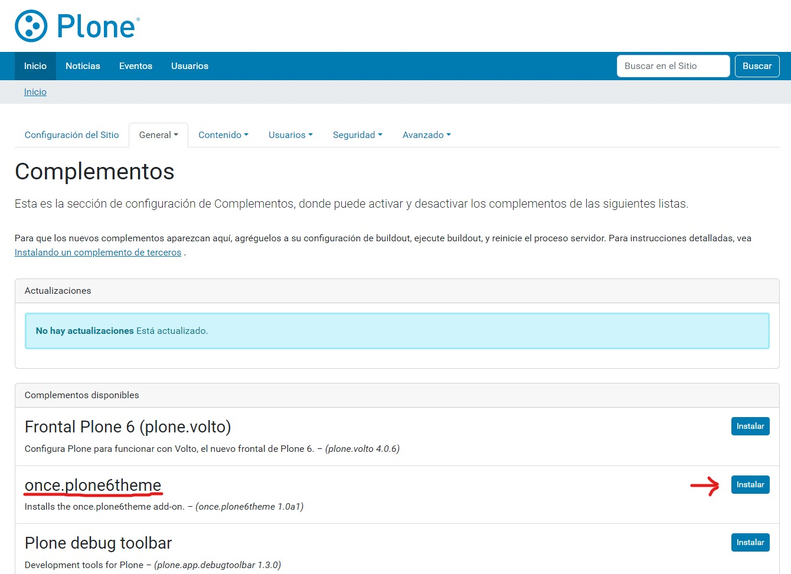
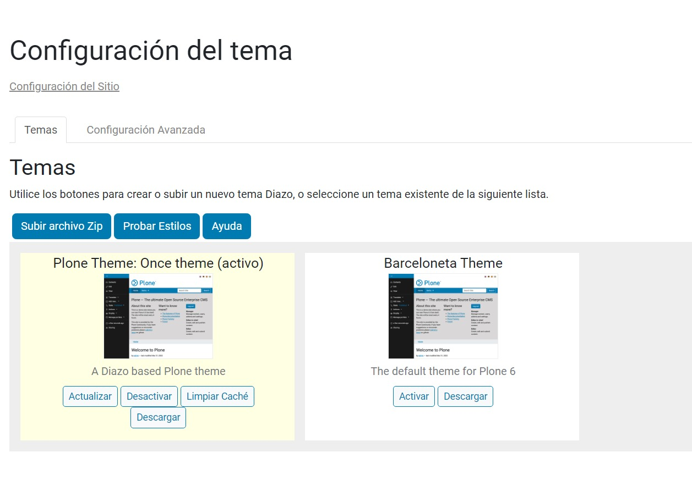

# Tema once.plone6theme

El tema principal para Plone 6 de ONCE será ``once.plone6theme``

## Obtener el paquete once.plone6theme

El paquete del tema principal para Plone 6 está ubicado en el repositorio ``WEB-COMMONS/once.plone6theme``

Dentro del archivo ``instance-develop.cfg`` añadiremos el paquete tanto en la sección ``SOURCES`` como en la sección ``develop`` ``eggs``

``` cfg title="instance-develop.cfg"
[sources]
once.plone6theme = git bitbucket.once.es:web-commons/once.plone6theme.git branch=master

[develop]
# development tools
parts =
    vscode

eggs =
    plone.reload
    Products.PDBDebugMode
    plone.app.debugtoolbar
    Products.PrintingMailHost
    pdbpp
    z3c.saconfig
    SQLAlchemy
    once.plone6theme

[versions]
sqlalchemy = 1.4.46

```

Después de ejecutar el comando ``buildout`` el producto aparecéra como instalable en el **panel de control "Complementos"**:

``` shell
bin/buildout
```

Procede a su instalación.

{ loading=lazy }

Ahora en el panel de configuración de temas, aparecerá nuestro tema activo:

{ loading=lazy }


## Instalar las dependencias del tema

Ejecute lo siguiente para instalar las dependencias con ``nvm`` y ``yarn``:

``` shell
cd ~/proyectos/weppor/src/once.plone6theme/src/once/plone6theme/theme
yarn install
```

Esto creará un directorio ``node_modules`` con todas las dependencias necesarias. No te preocupes, este directorio está excluido del control de versiones ``.gitignore``


``` tree title="once.plone6theme/src/once/plone6theme/theme"
.
├── README.rst
├── barceloneta-apple-touch-icon-114x114-precomposed.png
├── barceloneta-apple-touch-icon-144x144-precomposed.png
├── barceloneta-apple-touch-icon-57x57-precomposed.png
├── barceloneta-apple-touch-icon-72x72-precomposed.png
├── barceloneta-apple-touch-icon-precomposed.png
├── barceloneta-apple-touch-icon.png
├── barceloneta-favicon.ico
├── index.html
├── manifest.cfg
├── node_modules
│   ├── @nodelib
│   ├── @plone
│   ├── abbrev
│   ├── ansi-regex
│   ├── ansi-styles
│   ├── anymatch
│   ├── array-union
│   ├── autoprefixer
│   ├── available-typed-arrays
│   ├── balanced-match
│   ├── binary-extensions
│   ├── bootstrap
│   ├── brace-expansion
│   ├── braces
│   ├── browserslist
│   ├── call-bind
│   ├── caniuse-lite
│   ├── chalk
│   ├── chokidar
│   ├── clean-css
│   ├── clean-css-cli
│   ├── cliui
│   ├── color-convert
│   ├── color-name
│   ├── commander
│   ├── concat-map
│   ├── cross-spawn
│   ├── cssesc
│   ├── debug
│   ├── define-properties
│   ├── dependency-graph
│   ├── dir-glob
│   ├── electron-to-chromium
│   ├── emoji-regex
│   ├── error-ex
│   ├── es-abstract
│   ├── es-set-tostringtag
│   ├── es-to-primitive
│   ├── escalade
│   ├── escape-string-regexp
│   ├── fast-glob
│   ├── fastq
│   ├── fill-range
│   ├── for-each
│   ├── fraction.js
│   ├── fs-extra
│   ├── fs.realpath
│   ├── function-bind
│   ├── function.prototype.name
│   ├── functions-have-names
│   ├── get-caller-file
│   ├── get-intrinsic
│   ├── get-stdin
│   ├── get-symbol-description
│   ├── glob
│   ├── glob-parent
│   ├── globalthis
│   ├── globby
│   ├── gopd
│   ├── graceful-fs
│   ├── has
│   ├── has-bigints
│   ├── has-flag
│   ├── has-property-descriptors
│   ├── has-proto
│   ├── has-symbols
│   ├── has-tostringtag
│   ├── hosted-git-info
│   ├── ignore
│   ├── ignore-by-default
│   ├── immutable
│   ├── inflight
│   ├── inherits
│   ├── internal-slot
│   ├── is-array-buffer
│   ├── is-arrayish
│   ├── is-bigint
│   ├── is-binary-path
│   ├── is-boolean-object
│   ├── is-callable
│   ├── is-core-module
│   ├── is-date-object
│   ├── is-extglob
│   ├── is-fullwidth-code-point
│   ├── is-glob
│   ├── is-negative-zero
│   ├── is-number
│   ├── is-number-object
│   ├── is-regex
│   ├── is-shared-array-buffer
│   ├── is-string
│   ├── is-symbol
│   ├── is-typed-array
│   ├── is-weakref
│   ├── isexe
│   ├── json-parse-better-errors
│   ├── jsonfile
│   ├── lilconfig
│   ├── load-json-file
│   ├── lodash
│   ├── memorystream
│   ├── merge2
│   ├── micromatch
│   ├── minimatch
│   ├── ms
│   ├── nanoid
│   ├── nice-try
│   ├── node-releases
│   ├── nodemon
│   ├── nopt
│   ├── normalize-package-data
│   ├── normalize-path
│   ├── normalize-range
│   ├── npm-run-all
│   ├── object-inspect
│   ├── object-keys
│   ├── object.assign
│   ├── once
│   ├── parse-json
│   ├── path-is-absolute
│   ├── path-key
│   ├── path-parse
│   ├── path-type
│   ├── picocolors
│   ├── picomatch
│   ├── pidtree
│   ├── pify
│   ├── postcss
│   ├── postcss-cli
│   ├── postcss-load-config
│   ├── postcss-media-query-parser
│   ├── postcss-reporter
│   ├── postcss-resolve-nested-selector
│   ├── postcss-scss
│   ├── postcss-selector-parser
│   ├── postcss-sorting
│   ├── postcss-value-parser
│   ├── pretty-hrtime
│   ├── pstree.remy
│   ├── queue-microtask
│   ├── read-cache
│   ├── read-pkg
│   ├── readdirp
│   ├── regexp.prototype.flags
│   ├── require-directory
│   ├── resolve
│   ├── reusify
│   ├── run-parallel
│   ├── safe-regex-test
│   ├── sass
│   ├── semver
│   ├── shebang-command
│   ├── shebang-regex
│   ├── shell-quote
│   ├── side-channel
│   ├── simple-update-notifier
│   ├── slash
│   ├── source-map
│   ├── source-map-js
│   ├── spdx-correct
│   ├── spdx-exceptions
│   ├── spdx-expression-parse
│   ├── spdx-license-ids
│   ├── string-width
│   ├── string.prototype.padend
│   ├── string.prototype.trimend
│   ├── string.prototype.trimstart
│   ├── strip-ansi
│   ├── strip-bom
│   ├── stylelint-config-recess-order
│   ├── stylelint-config-recommended
│   ├── stylelint-config-recommended-scss
│   ├── stylelint-config-standard
│   ├── stylelint-config-standard-scss
│   ├── stylelint-config-twbs-bootstrap
│   ├── stylelint-order
│   ├── stylelint-scss
│   ├── supports-color
│   ├── supports-preserve-symlinks-flag
│   ├── thenby
│   ├── tinymce
│   ├── to-regex-range
│   ├── touch
│   ├── typed-array-length
│   ├── unbox-primitive
│   ├── undefsafe
│   ├── universalify
│   ├── update-browserslist-db
│   ├── util-deprecate
│   ├── validate-npm-package-license
│   ├── which
│   ├── which-boxed-primitive
│   ├── which-typed-array
│   ├── wrap-ansi
│   ├── wrappy
│   ├── y18n
│   ├── yaml
│   ├── yargs
│   └── yargs-parser
├── package-lock.json
├── package.json
├── preview.png
├── rules.xml
├── styles
│   ├── theme.css
│   ├── theme.css.map
│   ├── theme.min.css
│   ├── theme.min.css.map
│   └── theme.scss
├── tinymce-templates
│   ├── README.rst
│   ├── card-group.html
│   └── list.html
└── yarn.lock

```

## Compilar el tema

!!! tip "Compilar el tema"
    Ahora ya puedes compilar el tema online o para su distribución con los comandos explicados en [Comandos básicos para el tema](./index.md#comandos-basicos-para-el-tema)